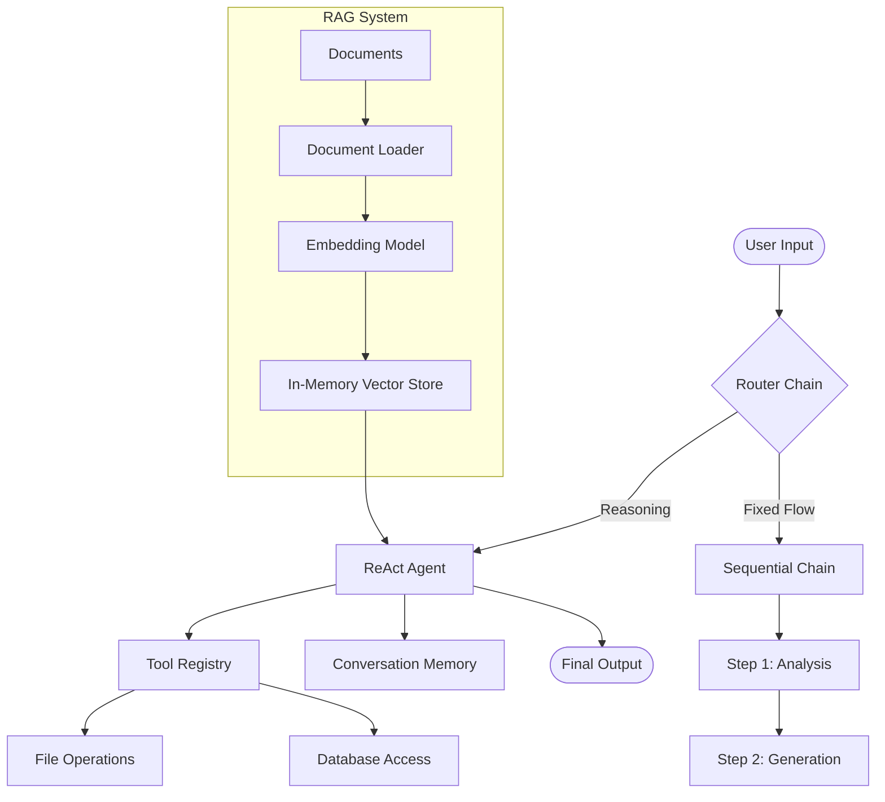

# 🏗️ LaraChain (Beta)

[](https://packagist.org/packages/subhashladumor1/larachain)
[](https://github.com/subhashladumor1/larachain/actions)
[](https://packagist.org/packages/subhashladumor1/larachain)

**LaraChain** is a powerful, LangChain-inspired AI orchestration framework built specifically for **Laravel 12**. It leverages the native **Laravel AI SDK** to provide a seamless way to build complex, multi-step AI agents, chains, and RAG (Retrieval-Augmented Generation) systems with professional-grade elegance.

---

## 🚀 Key Features

- **Built for Laravel 12**: Native integration with `laravel/ai` and the `agent()` helper.
- **Smart Agents (ReAct)**: Reasoning-based agents that can use tools and make decisions.
- **Multi-Step Chains**: Combine multiple LLM prompts or logic steps into a single workflow.
- **RAG Ready**: Built-in Vector Search, Embeddings, and Document Loaders (PDF, CSV, Web).
- **Multi-Language Support**: Seamlessly handle prompts and responses in any language supported by the LLM.
- **Pluggable Architecture**: Easily swap models, vector stores, or memory drivers.

---

## 🗺️ Architecture Overview



---

## 🛠️ Installation

> **Note:** LaraChain is currently in **Beta**. We recommend testing in a development environment.

You can install the package via composer:

```bash
composer require subhashladumor1/larachain
```

The package will automatically register its service provider. You can publish the configuration file with:

```bash
php artisan vendor:publish --tag="larachain-config"
```

---

## 📖 Quick Start

### 1. Simple LLM Chain
Execute a prompt template with variable substitution.

```php
use LaraChain\Prompts\PromptTemplate;
use LaraChain\Chains\LLMChain;

$template = PromptTemplate::make('Translate the following text to {language}: {text}');
$chain = new LLMChain($template, model: 'gpt-4o');

$result = $chain->execute([
    'language' => 'Spanish',
    'text' => 'LaraChain makes AI orchestration easy!'
]);

echo $result; // "LaraChain hace que la orquestación de IA sea fácil."
```

### 2. Intelligent ReAct Agent
An agent that thinks, acts, and uses tools to answer questions.

```php
use LaraChain\Agents\AgentExecutor;
use LaraChain\Toolkits\FileToolkit;
use LaraChain\Memory\BufferMemory;

$agent = AgentExecutor::make()
    ->tools((new FileToolkit())->getTools()) // Give it file read/write powers
    ->memory(new BufferMemory(limit: 10));

$response = $agent->run("Read the version in version.txt and write a summary in summary.md");
```

---

## 🌍 Multi-Language Support

LaraChain is designed to be globally ready. Since it is built on top of the Laravel AI SDK, it inherits the broad linguistic capabilities of modern LLMs.

- **Non-English Prompts**: You can write your `PromptTemplates` in Hindi, Spanish, French, Japanese, etc.
- **Cross-Lang Reasoning**: Agents can process a question in one language and search documents in another.
- **UTF-8 Native**: All internal parsers and message objects handle multi-byte characters perfectly.

---

## 📈 Use Cases

1.  **Automated Customer Support**: Combine a `RouterChain` to distinguish between "Tech Support" and "Billing", then use a `VectorRetriever` to pull answers from your documentation.
2.  **Content Transformation Pipelines**: Use a `SequentialChain` to:
    - Step 1: Extract keywords from an article.
    - Step 2: Translate those keywords.
    - Step 3: Generate a meta-description based on them.
3.  **Autonomous File Assistants**: Give an agent a `FileToolkit` to help reorganize project files or generate code documentation.

---

## ⚙️ Configuration

Your `config/larachain.php` allows you to set global defaults:

```php
return [
    'default_model' => env('LARACHAIN_MODEL', 'gpt-4o'),
    'default_embedding_model' => env('LARACHAIN_EMBEDDING_MODEL', 'text-embedding-3-small'),
];
```

---

## 🧪 Testing

LaraChain comes with a comprehensive test suite. To run it:

```bash
composer test
```

We use **Pest** for testing and **Prism** for mocking AI responses to ensure your CI/CD pipelines don't require actual API keys.

---

## 🤝 Contributing

Contributions are welcome! Please feel free to submit a Pull Request.

## 📄 License

The MIT License (MIT). Please see [License File](LICENSE.md) for more information.
