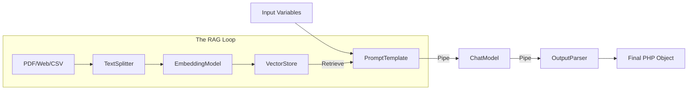

# 🏗️ LaraChain (Beta Version)

[](https://packagist.org/packages/subhashladumor1/larachain)
[](https://github.com/subhashladumor1/larachain/actions)

**LaraChain** is a LangChain-inspired AI orchestration framework built specifically for **Laravel 12**. In 2026, building AI apps is no longer just about calling an API—it's about building **Stateful Workflows**, **Agentic Tools**, and **Modern RAG pipelines**. LaraChain provides the primitives to build these with professional-grade elegance and type safety.

---

## 🗺️ How LaraChain Works

LaraChain follows a "Runnable" architecture where every component—prompts, models, retrievers, and parsers—can be piped together.



---

## 🚀 Key Features

| Feature | Description |
| :--- | :--- |
| **LCEL-style Piping** | Use the `.pipe()` pattern to chain components like a pro. |
| **Smart Agents** | ReAct (Reasoning + Acting) agents that use tools and make decisions. |
| **Advanced RAG** | Document loaders, recursive text splitting, and vector retrieval. |
| **Postgres Support** | Native `pgvector` integration for production-ready storage. |
| **Memory Drivers** | Stateful conversation buffers to maintain context. |
| **Laravel 12 Native** | Deeply integrated with the Laravel AI SDK and Service Container. |

---

## 📂 Folder Structure

```text
larachain/
├── src/
│   ├── Agents/           # ReAct and Agentic logic
│   ├── Chains/           # Pipeline orchestration (Sequential, Router)
│   ├── Contracts/        # Interfaces for all components
│   ├── DocumentLoaders/  # Reading PDF, Web, CSV contents
│   ├── Embeddings/       # Vector generation logic
│   ├── Laravel/          # Service Providers and Facades
│   ├── Memory/           # Conversation state management
│   ├── Messages/         # Message objects (User, Assistant, System)
│   ├── Models/           # AI Model wrappers (ChatModel)
│   ├── Parsers/          # Output formatting (JSON, XML)
│   ├── Prompts/          # Template management
│   ├── Retrieval/        # Document retrieval logic
│   ├── Support/          # Traits and Helpers (HasPipe)
│   ├── TextSplitters/    # Document chunking logic
│   ├── Toolkits/         # Grouped tools (File, Database)
│   ├── Tools/            # Individual tool implementations
│   └── VectorStores/     # Storage drivers (In-Memory, Postgres)
```

---

## 📖 Functional API Guide

### 1. The Pipe Pattern (Recommended)
The hallmark of LaraChain 2026 is the ability to chain components elegantly.

```php
use LaraChain\Prompts\PromptTemplate;
use LaraChain\Models\ChatModel;
use LaraChain\Parsers\JsonParser;

$chain = PromptTemplate::make('Extract data from this text: {text} into JSON format.')
    ->pipe(new ChatModel('gpt-4o'))
    ->pipe(new JsonParser());

$output = $chain->invoke(['text' => 'My name is John and I live in London.']);
// Returns: ['name' => 'John', 'location' => 'London']
```

### 2. Intelligent Agents
An agent can use specialized tools to complete complex tasks.

```php
use LaraChain\Agents\AgentExecutor;
use LaraChain\Toolkits\FileToolkit;

$agent = AgentExecutor::make()
    ->tools((new FileToolkit())->getTools());

$response = $agent->run("Read config.json and summarize it in readme.md");
```

### 3. RAG (Postgres + Recursive Chunking)
Handle large documents with state-of-the-art chunking and production storage.

```php
use LaraChain\TextSplitters\RecursiveCharacterTextSplitter;
use LaraChain\VectorStores\PostgresVectorStore;
use LaraChain\Embeddings\EmbeddingModel;

$splitter = new RecursiveCharacterTextSplitter(chunkSize: 1000, chunkOverlap: 200);
$chunks = $splitter->splitText($largePdfContent);

$store = new PostgresVectorStore(new EmbeddingModel());
$store->addTexts($chunks);
```

---

## ⚖️ LaraChain vs. LangChain (For Laravel)

| Feature | LangChain (Python/JS) | **LaraChain (PHP/Laravel)** |
| :--- | :--- | :--- |
| **Syntax** | Pipe Operator (`\|`) | Fluent `.pipe()` Method |
| **Integration** | Ad-hoc | Native Service Providers / Facades |
| **I/O** | General | Laravel FileSystem / DB Facades |
| **Agents** | LangGraph | ReAct / Future LaraGraph |
| **Models** | Custom Drivers | Laravel AI SDK (Native) |

---

## 📈 Use Cases

1.  **Semantic Document Search**: Build a "Chat with your PDF" app in minutes using `RecursiveSplitter` and `PostgresVectorStore`.
2.  **Autonomous Code Auditor**: Use the `FileToolkit` and `AgentExecutor` to scan your repository for security flaws.
3.  **Structured Data Extraction**: Pipe raw OCR text through a `ChatModel` and `JsonParser` to ingest invoices into your database.

---

## 🛠️ Installation & Setup

```bash
composer require subhashladumor1/larachain
php artisan vendor:publish --tag="larachain-config"
```

Refer to [LARACHAIN_VERIFICATION_2026.md](LARACHAIN_VERIFICATION_2026.md) for detailed verification of all 2026 market features.

---

## 🛠️ Multi-Provider Management

LaraChain uses a **Driver-based Architecture** (similar to Laravel's Database or Mail systems). You can configure and switch between providers at runtime.

### 1. Configuration (`config/larachain.php`)
Define multiple LLM, Vector, and Embedding providers:

```php
'default' => [
    'llm' => 'openai',
    'vectorstore' => 'postgres',
],

'llms' => [
    'openai' => ['model' => 'gpt-4o'],
    'anthropic' => ['model' => 'claude-3-5-sonnet'],
],
```

### 2. Switching Providers at Runtime
Use the `LaraChain` facade to swap drivers dynamically:

```php
// Use Anthropic instead of the default OpenAI
$model = LaraChain::model('anthropic');

// Use a specific vector store
$vectorStore = LaraChain::vectors()->driver('memory');

// Chain them together
$chain = PromptTemplate::make('Hello {name}')
    ->pipe($model)
    ->pipe(new JsonParser());
```

---

## ⚙️ Configuration
Contributions are welcome! Pull requests for new Vector Drivers (Pinecone, Qdrant) are prioritized.

## 📄 License
The MIT License (MIT). See [License File](LICENSE.md).
